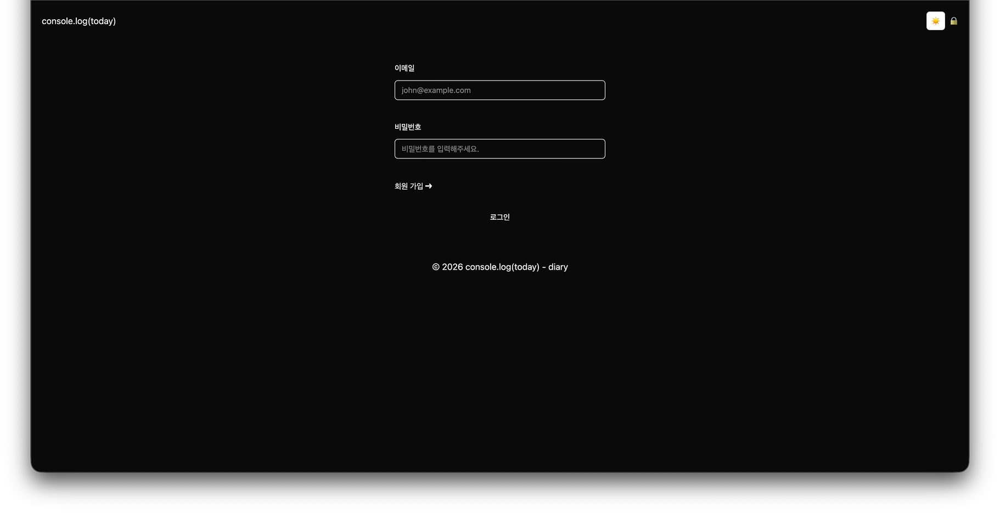
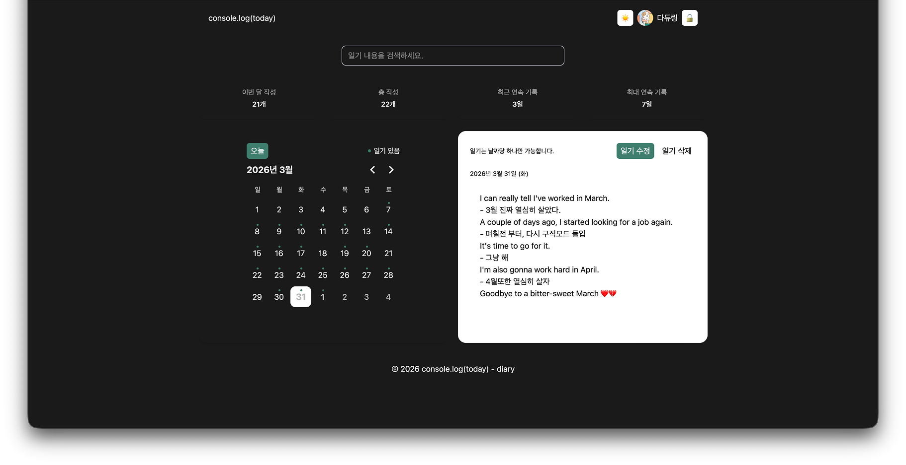
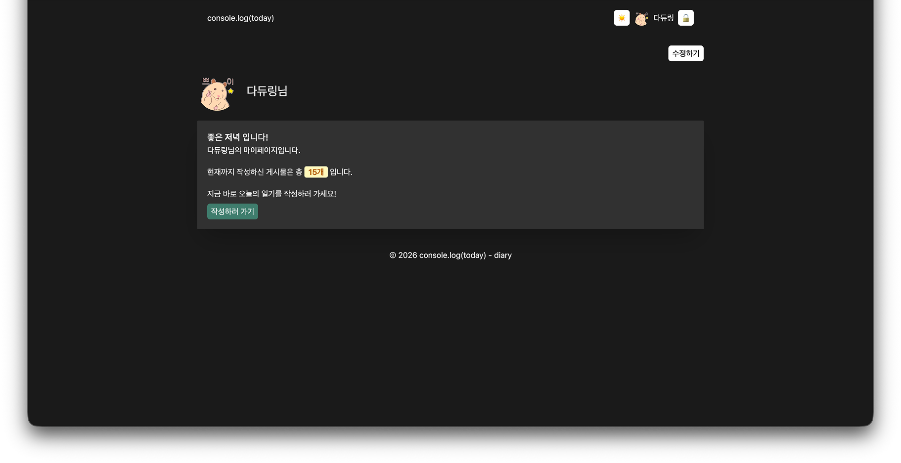

# console.log(today)

Demo: https://console-log-today-xhnt.vercel.app/

- 사용자의 일기를 날짜별로 기록하고 관리할 수 있는 웹 애플리케이션입니다.

- 캘린더 기반 UI를 통해 특정 날짜의 일기를 확인하고, 작성/수정/삭제할 수 있으며 연속 기록을 통해 사용자의 기록 습관을 시각적으로 제공합니다.

## 미리보기

### 로그인



### 홈



### 마이페이지



## 주요 기능

- 📅 캘린더 기반 일기 조회
- ✍️ 일기 작성 / 수정 / 삭제 (CRUD)
- 🔥 연속 기록(streak) 계산
- 📊 월별 / 전체 작성 통계
- 👤 프로필 수정 (닉네임, 아바타)
- 🌙 다크모드 지원

## 기술 스택

- React
- TypeScript
- TanStack Query (React Query)
- Zustand (전역 상태 관리)
- Supabase (Auth / DB / Storage)
- Tailwind CSS
- date-fns
- React-hook-form
- zod

## 핵심 구현 포인트

### 1. React Query 기반 데이터 관리

- queryKey를 도메인 단위로 구조화하여 캐시 일관성 유지
- invalidateQueries를 활용해 CRUD 이후 데이터 자동 동기화

### 2. 캘린더 성능 최적화

- 일기 존재 여부를 Set으로 변환하여 불필요한 반복 탐색 제거

### 3. 연속 기록(streak) 알고리즘 구현

- 날짜를 기준으로 역순 탐색하여 현재 연속 기록 계산
- 정렬 + 인접 날짜 비교를 통해 최대 연속 기록 계산

### 4. UI 상태 관리 분리

- view / edit 모드를 명확히 분리하여 UX 안정성 확보
- 수정 취소 시 원래 데이터 복구 처리

### 5. 비동기 UX 개선

- mutation onSuccess를 활용한 정확한 사용자 피드백 처리
- optimistic update를 일부 적용하여 반응성 개선

### 6. Form 상태 관리 및 유효성 검증

- React Hook Form을 사용하여 로그인/회원가입 폼의 상태를 효율적으로 관리하고, 불필요한 리렌더링을 최소화
- 회원가입 페이지에서는 Zod를 적용하여 입력값 검증 로직을 스키마로 분리
- 비밀번호 확인, 길이 제한 등의 검증을 schema 기반으로 처리하여 컴포넌트의 복잡도 감소
- Zod의 infer를 활용해 타입과 검증 로직을 일치시켜 안정성 확보

## 실행 방법

```bash
npm install
npm run dev
```
